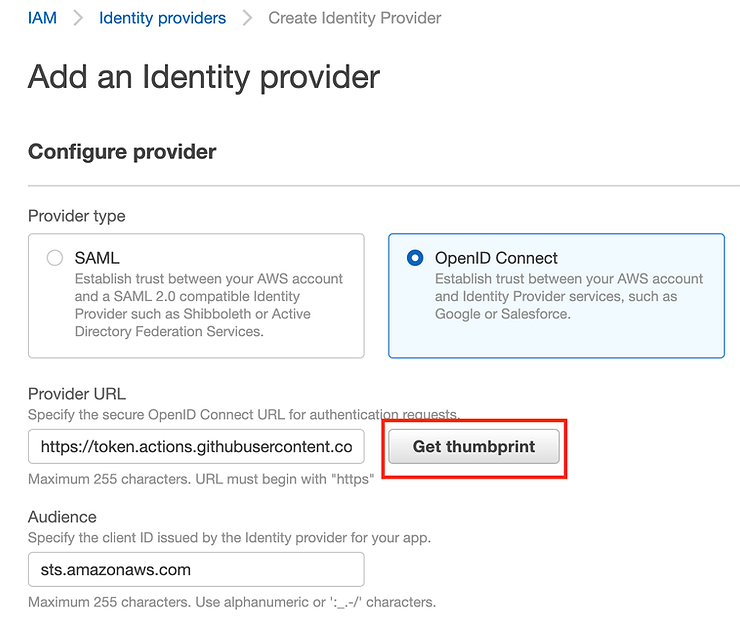
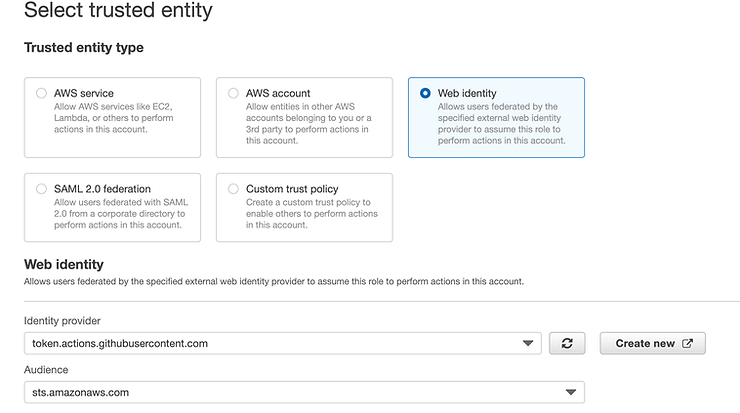

TODO:

- [Protect branches](https://docs.github.com/en/enterprise/2.16/admin/developer-workflow/configuring-protected-branches-and-required-status-checks)

Links

- [Github role](https://benoitboure.com/securely-access-your-aws-resources-from-github-actions)

# Set up Github repo

## Create an OpenID Connect Identity provider

The first step is to create an OpenID Connect (OIDC) identity provider in your AWS Account. This will allow Github to identify itself.

- Got to the IAM console -> Identity providers
- Click Add new provider
- Select OpenID Connect
- Provider Url: https://token.actions.githubusercontent.com (Don't forget to click Get Thumbprint)
- Audience: sts.amazonaws.com
- Add tags if you want to and click Add Provider





## Create a role

You now need to create a role that Github will be able to assume in order to access the resources it needs to control.

- Go back to IAM and select Roles
- Create a new Role
- Chose Web Identity, select the Identity provider you created in the previous step, and its audience.
- Click Next:Permissions

### Permission policies

> FIXME: for simplicity I'll put admin permission to start since it's hard to predict terraform needs. We will follow least-privilege principles by monitoring terraform needs trough AWS and then apply those minimal policies. Removing policies is way faster than trial and error.

There is now an additional step to do. You need to edit the trust policy of the role to reduce its scope to your repository only. Make sure you don't skip this part, it is very important. Without that, any repository on GitHub will be able to assume your role and access your resources. (Unfortunately, there does not seem to be a way to do that at creation time).

Go back to IAM Roles and select the created Role. Choose Trust Relationships and Edit Trust Relationship.

Under Condition, add the following segment:

```json
"StringLike": {
  "token.actions.githubusercontent.com:sub": "repo:[your-org]/[your-repo]:*"
}
```

The final result will look like this:

```json
{
  "Version": "2012-10-17",
  "Statement": [
    {
      "Effect": "Allow",
      "Principal": {
        "Federated": "arn:aws:iam::1234567890:oidc-provider/token.actions.githubusercontent.com"
      },
      "Action": "sts:AssumeRoleWithWebIdentity",
      "Condition": {
        "StringEquals": {
          "token.actions.githubusercontent.com:aud": "sts.amazonaws.com"
        },
        "StringLike": {
          "token.actions.githubusercontent.com:sub": "repo:[your-org]/[your-repo]:*"
        }
      }
    }
  ]
}
```

This concludes the required configurations on your AWS account. Take note of the role ARN, you'll need it later.

## Set the Github secrets

set the role arn in the secret `AWS_GITHUB_ROLE`, and the region to use `AWS_REGION`

### Configure Github action workflow

Your Github workflow requires additional permissions in order to be able to use OIDC. Add the following at the top of your workflow's YML file. You can also add it at the job level to reduce the scope if needed.

```yaml
permissions:
  id-token: write # required to use OIDC authentication
  contents: read # required to checkout the code from the repo
```

You can now use the configure-aws-credentials Github action in the job that needs to assume the role. Add this step to generate credentials before doing any call to AWS:

```yaml
- name: configure aws credentials
  uses: aws-actions/configure-aws-credentials@v1
  with:
    role-to-assume: ${{ secrets.AWS_GITHUB_ROLE }}
    role-duration-seconds: 900 # the ttl of the session, in seconds.
    aws-region: ${{ secrets.AWS_REGION }}# use your region here.
```

The configure AWS credentials step will use the OIDC integration to assume the given role, generate short-lived credentials, and make them available to the current job.
