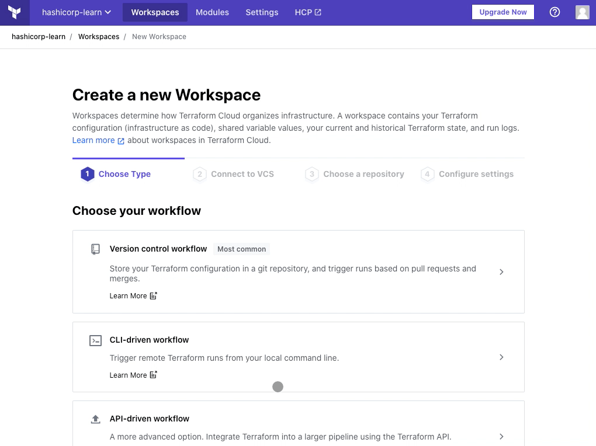
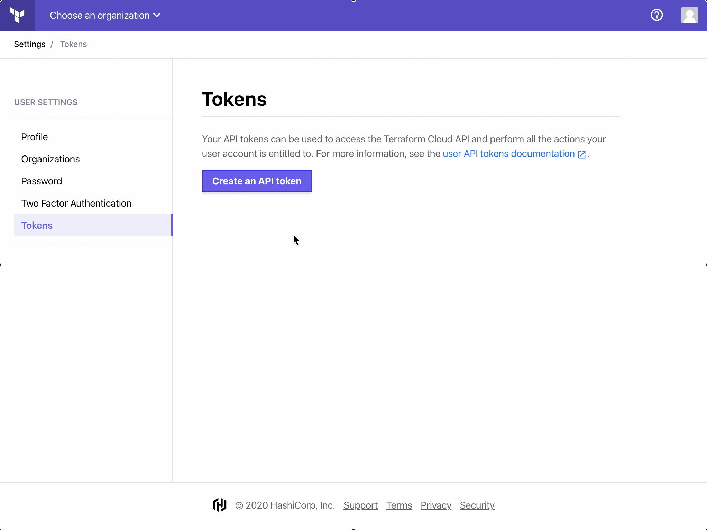
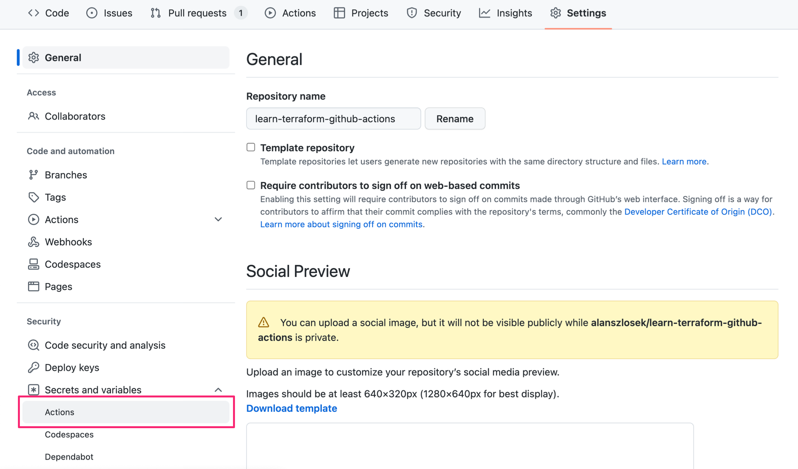

links:

- [Teraform Github actions](https://developer.hashicorp.com/terraform/tutorials/automation/github-actions)
- [AWS OIDC terraform](https://labinhood.com/blog/2023/02/terraform-cloud-and-aws-via-openid-connect-oidc/) and [Terraform docs OICD](https://developer.hashicorp.com/terraform/cloud-docs/workspaces/dynamic-provider-credentials/aws-configuration)

TODO:

- Terraform cloud with organization called terraform-organization
- cars-terraform-branch-main must be present (look at -github/workflows/terraform)
- Variable-set for all workspaces

# Set up Terraform Cloud

## Create an Organization on terraform cloud

## Create workspace on Terraform cloud

The GitHub Action you create will connect to Terraform Cloud to plan and apply your configuration. Before we set up the Actions workflow, you must create a workspace, add your AWS service credentials to your Terraform Cloud workspace, and generate a user API token.

## Create an OIDC on AWS

OpenID Connect is an authentication protocol that works on top of the OAuth 2.0 framework, and it is based on a two-way trust relationship pre-established between the parties (in this case Terraform Cloud and AWS) to dynamically generate credentials when they are needed.

An OpenID Connect setup is much more secure, and the following are the steps to configure it for Terraform Cloud and AWS:

### Step 1: Create an OIDC Identity Provider in AWS (IAM)

In your AWS account:

- Go to IAM > Identity providers and click on “Add provider”
- In the “Add an Identity provider” screen:
- Select “OpenID Connect”
- For “Provider URL”, set it to “https://app.terraform.io”
- Click on the button “Get thumbprint” right after, a box with the thumbprint and CA information should come up
- For the “Audience” field, set it to “aws.workload.identity”, this is the default that Terraform Cloud will provide when authenticating, but it can be customized if you require it, you just need to make sure you do on both sides so they match
- Finally click on the “Add provider” button to submit

### Step 2: Configure a Role and Trust Policy in AWS

Next, we need the role that Terraform Cloud will assume if authentication is successful, you can associate a particular subset of permissions for the role following the “principle of the least privilege” (only provide the exact permissions a principal will need to perform their job and nothing more).

To create the required role and associated trust policy:

- Go to IAM > Roles and click on “Create role”
- Then, follow the screens to:
  - In the “Select trusted entity” screen, pick the “Web identity” option, and select “app.terraform.io” and “aws.workload.identity” for the “Identity provider” and “Audience” fields respectively.
  - Add permissions in the next screen\*\*.
  - Finally, provided a meaningful name for your new role, and click “Create role”.
  - Once the new role has been created, copy its ARN so it can be entered on the Terraform Cloud side.

> FIXME: for simplicity I'll put admin permission to start since it's hard to predict terraform needs. We will follow least-privilege principles by monitoring terraform needs trough AWS and then apply those minimal policies. Removing policies is way faster than trial and error.

## Add Environment Variables to Terraform Cloud

Next, we need to instruct Terraform Cloud to assume the new role via OIDC, and we to this through setting a couple of environment variables:

| Environment Variable Name | Description                                                                                                                                     |
| ------------------------- | ----------------------------------------------------------------------------------------------------------------------------------------------- |
| `TFC_AWS_PROVIDER_AUTH`   | As the Terraform Cloud documentation explains it: Must be present and set to “true”, or Terraform Cloud will not attempt to authenticate to AWS |
| `TFC_AWS_RUN_ROLE_ARN`    | This is the ARN of the role that Terraform Cloud needs to assume                                                                                |
| `AWS_DEFAULT_REGION`      | The default region that the AWS provider will use if no other is explicitly specified                                                           |

The following is how the environment variables look in a Terraform Cloud variable set:

## Create Access token on Terraform cloud

Finally, go to the [Tokens](https://app.terraform.io/app/settings/tokens?utm_source=learn) page in your Terraform Cloud User Settings. Click on Create an API token and generate an API token named GitHub Actions.

Save this token in a safe place. You will add it to GitHub later as a secret, so the Actions workflow can authenticate to Terraform Cloud.

## Set up te Github repository

Save the token as a secret called `TF_API_TOKEN`

