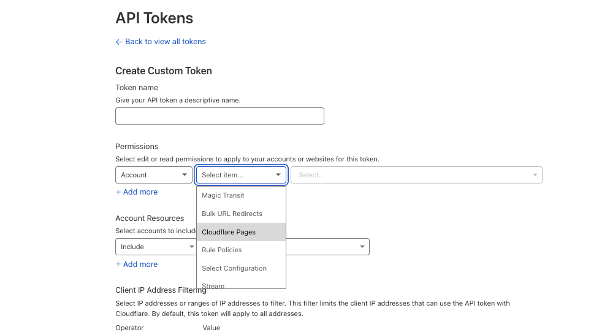

links

- [Cloudflare docs](https://developers.cloudflare.com/pages/how-to/use-direct-upload-with-continuous-integration/)

# Create a cloudflare account

## Register a domain

## Create a pages Project and add name as repo variable on github

`CLOUDFLARE_PROJECT_NAME`

# Get credentials from Cloudflare

​​Generate an API Token
To generate an API token:

## Log in to the Cloudflare dashboard.

Select My Profile from the dropdown menu of your user icon on the top right of your dashboard.
Select API Tokens > Create Token.
Under Custom Token, select Get started.
Name your API Token in the Token name field.
Under Permissions, select Account, Cloudflare Pages and Edit:
Select Continue to summary > Create Token.
Follow the instructions above to create an API token for Cloudflare Pages

Now that you have created your API token, you can use it to push your project from continuous integration platforms.



## ​Get project account ID

To find your account ID, log in to the Cloudflare dashboard > select your zone in Account Home > find your account ID in Overview under **API\* on the right-side menu. If you have not added a zone, add one by selecting **Add site\*\*. You can purchase a domain from Cloudflare’s registrar

# Add Cloudflare credentials to GitHub secrets

In the GitHub Action you have set up, environment variables are needed to push your project up to Cloudflare Pages. To add the values of these environment variables in your project’s GitHub repository:

- Go to your project’s repository in GitHub.
- Under your repository’s name, select Settings.
- Select Secrets > Actions > New repository secret.
- Create one secret and put `CLOUDFLARE_ACCOUNT_ID` as the name with the value being your Cloudflare account ID.
- Create another secret and put `CLOUDFLARE_API_TOKEN` as the name with the value being your Cloudflare API token.
- This will ensure that the secrets are secure. Each time your GitHub - Actions runs, it will access these secrets.

Add the value of your Cloudflare account ID and Cloudflare API token as `CLOUDFLARE_ACCOUNT_ID` and `CLOUDFLARE_API_TOKEN`, respectively. This will ensure that these secrets are secure, and each time your Action runs, it will access these secrets.

## Set up a workflow

Create a .github/workflows/pages-deployment.yaml file at the root of your project. The `.github/workflows/pages-deployment.yaml` file will contain the jobs you specify on the request, that is: on: [push] in this case. It can also be on a pull request. For a detailed explanation of GitHub Actions syntax, refer to the official documentation.

In your pages-deployment.yaml file, copy the following content:

```yaml
.github/workflows/pages-deployment.yaml
on: [push]
jobs:
  deploy:
    runs-on: ubuntu-latest
    permissions:
      contents: read
      deployments: write
    name: Deploy to Cloudflare Pages
    steps:
      - name: Checkout
        uses: actions/checkout@v3
      # Run your project's build step
      # - name: Build
      #   run: npm install && npm run build
      - name: Publish
        uses: cloudflare/pages-action@1
        with:
          apiToken: ${{ secrets.CLOUDFLARE_API_TOKEN }}
          accountId: ${{ secrets.CLOUDFLARE_ACCOUNT_ID }}
          projectName: YOUR_PROJECT_NAME # e.g. 'my-project'
          directory: YOUR_DIRECTORY_OF_STATIC_ASSETS # e.g. 'dist'
          gitHubToken: ${{ secrets.GITHUB_TOKEN }}
```

In the above code block, you have set up an Action that runs when you push code to the repository. Replace `YOUR_PROJECT_NAME` with your Cloudflare Pages project name and `YOUR_DIRECTORY_OF_STATIC_ASSETS` with your project’s output directory, respectively.

The `${{ secrets.GITHUB_TOKEN }}` will be automatically provided by GitHub Actions with the contents: read and deployments: write permission. This will enable our Cloudflare Pages action to create a Deployment on your behalf.
